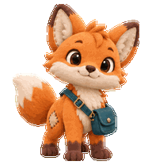

# ChatGPT Pets 🐾

两只自定义动画宠物：**Patch** 和 **银发少女与飞行伙伴**。由 [@xulianglong-akk](https://github.com/xulianglong-akk) 分享，提供透明图集、动画预览和可安装的宠物目录。

Two animated companions shared by @xulianglong-akk, with transparent sprite sheets, previews, and installable pet packages.

| Patch | 银发少女与飞行伙伴 |
|---|---|
|  |  |
| 温暖好奇的小狐狸，带着青绿色挎包。 | 银发少女与身旁的小飞行机器人。 |

## 下载与使用

在 GitHub 点击 **Code → Download ZIP** 并解压，或者克隆本仓库。

### ChatGPT 宠物上传

在支持宠物功能的 ChatGPT 界面打开宠物选择器，使用 **Upload pet / 上传宠物**，选择对应目录的图集文件。功能是否可用取决于账号和客户端。

- `spritesheet.png`：v2，1536 × 2288，九种动画状态及十六个视线方向。
- `spritesheet-v1.png`：v1，1536 × 1872，仅九种动画状态；适用于只接受 v1 的上传界面。

OpenAI 当前的[宠物说明](https://learn.chatgpt.com/docs/pets)列出了网页端的 v1 上传要求；本仓库同时保留 v1 和 v2 导出文件。上传文件时保留透明背景和原始尺寸。

### Codex 本地宠物目录

将每只宠物的 `pet.json` 与 `spritesheet.png` 一起放入自己的 Codex 宠物目录：

```text
~/.codex/pets/patch-maker-fox/
├── pet.json
└── spritesheet.png

~/.codex/pets/silver-haired-companion/
├── pet.json
└── spritesheet.png
```

Windows 默认目录为 `%USERPROFILE%\.codex\pets\`；设置了 `CODEX_HOME` 时使用该目录下的 `pets`。在客户端刷新宠物列表后选择宠物。本地安装与网页端上传分别进行。

## 动画预览

- **Patch**：[九种状态](pets/patch/all-states.gif) · [十六方向](pets/patch/look-loop.gif) · [完整图集总览](pets/patch/contact-sheet.png)
- **银发少女与飞行伙伴**：[九种状态](pets/silver-haired-companion/all-states.gif) · [十六方向](pets/silver-haired-companion/look-loop.gif) · [完整图集总览](pets/silver-haired-companion/contact-sheet.png)

每个 `animations/` 目录还包含 idle、running-right、running-left、waving、jumping、failed、waiting、running、review 的独立 GIF。

## 格式与验证

- 单元尺寸：192 × 208；v2 为 8 列 × 11 行，v1 为 8 列 × 9 行。
- 九种状态的帧数：6、8、8、4、5、8、6、6、6。
- v2 最后两行各有 8 个视线方向帧。
- 发布副本清空了原始导出中未使用格内的额外图案，所需动作帧的像素保持原样。
- 本地结构检查结果见每只宠物的 `validation.json`；文件校验和见 `SHA256SUMS`。

验证记录仅说明图集结构符合检查规则，不代表每个客户端都已实机测试，也不代表动画的所有语义都经过独立评审。

## 许可与署名

图集、预览、元数据及说明文档按 **[CC BY 4.0](https://creativecommons.org/licenses/by/4.0/)** 分享，完整条款见 [LICENSE](LICENSE)。可以复制、分享和修改，包括商业用途；请署名、保留许可链接并说明修改。

推荐署名：`ChatGPT Pets — xulianglong-akk — CC BY 4.0`。

这是社区宠物资源项目，非 OpenAI 官方项目。

---

Export prepared on 2026-10-07. Artwork and documentation: CC BY 4.0.

